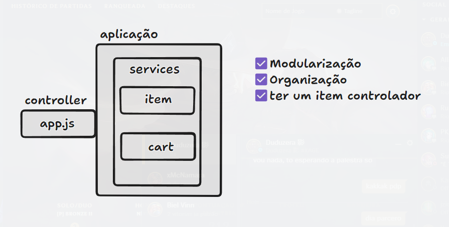

## Objetivo

Criar um carrinho de compras baseado no carrinho de compras da shopee, onde o carrinho de compras armazene itens e faça o calculo de sub-itens automaticamente.

//Dominio da aplicação: carrinho de compras

//As entidades representadas
//Carrinho = cart.js
//Itens = item.js

